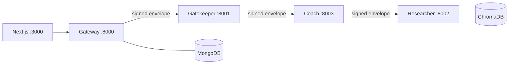

# FitCoach: Agentic AI Fitness Coaching System

Coursework for IT3041 Information Retrieval and Web Analytics, SLIIT.

Users log strength training in plain language. The system sanitises the input
through a nine-layer trust pipeline, retrieves grounded exercise-science
evidence, and computes progressive-overload recommendations deterministically.
Every reply shows how its decision was reached.

---

## What it does

```
You:   Squatted 100kg for 8 reps today

       ALLOW · LOG_WORKOUT · risk 0.00 · rule ALLOW-DEFAULT · 17ms   [why?]

Coach: You hit 8 reps at 100kg, the top of the 5-8 range, so add 5kg and
       work back up from 5 reps.
       Sources: Kraemer and Ratamess (2004); NSCA Essentials
```

The load is computed by a pure function, not generated. The language model only
phrases the result.

---

## Architecture



| Service | Port | Responsibility | Owner |
| --- | --- | --- | --- |
| `gateway` | 8000 | Auth, JWT, rate limiting, SSE streaming | Yathurshan |
| `agent1_gatekeeper` | 8001 | Nine-layer trust, safety and NLU pipeline | Yathurshan |
| `agent2_researcher` | 8002 | RAG retrieval over the evidence corpus | Teammate |
| `agent3_coach` | 8003 | Progressive-overload maths and telemetry | Teammate |

Full diagrams in [docs/architecture.md](docs/architecture.md). Wire protocol in
[docs/protocol.md](docs/protocol.md).

---

## Measured results

Detector performance over 300 labelled utterances
([eval/gatekeeper/](eval/gatekeeper/)):

| Configuration | Precision | Recall | F1 | False positive rate |
| --- | --- | --- | --- | --- |
| Rules + embeddings | 1.000 | 0.867 | 0.929 | 0.000 |
| All three signals | **1.000** | **0.944** | **0.971** | **0.000** |

Five of 90 adversarial inputs are not detected. They are analysed rather than
hidden, in [ADR 0005](docs/adr/0005-hybrid-threat-detection.md).

| Measurement | Value |
| --- | --- |
| L1 to L3 latency (p95, 182 chars) | 0.39 ms |
| Full pipeline (p50) | 12 ms |
| Full pipeline (p95, judge invoked) | 1.97 s |
| Judge invocation rate | 19 of 300 cases |
| Tests | 259 passing |

---

## Prerequisites

- Python 3.13
- MongoDB on `localhost:27017`, or the bundled compose service
- Node.js 20 or newer for the web client
- Docker Desktop, optional

---

## Setup

```bash
python -m venv .venv
.venv/Scripts/activate            # Windows; source .venv/bin/activate on POSIX
pip install -e ".[gateway,gatekeeper,researcher,coach,dev]"
python -m spacy download en_core_web_sm

cp .env.example .env              # then fill in every value
```

Generate the two secrets:

```bash
python -c "import secrets; print(secrets.token_urlsafe(48))"
```

`.env` is gitignored and has never been committed. Verify with
`git check-ignore -v .env`.

### Seeding the knowledge base

Nothing to run. The researcher seeds ChromaDB from
`services/agent2_researcher/corpus.py` on first start, and the seed is
idempotent.

---

## Running

```bash
docker compose up --build         # everything, including MongoDB

# or, against a local MongoDB
pwsh scripts/devstack.ps1 start    # starts all four, waits, reports health
cd web && npm install && npm run dev
```

Verify:

```bash
curl http://localhost:8000/health
curl http://localhost:8001/health
curl http://localhost:8002/health
curl http://localhost:8003/health
```

The Gatekeeper takes about 15 seconds to become healthy on first start, because
it loads spaCy and the embedding model before serving.

---

## Tests and benchmarks

```bash
pytest -q                                   # 259 tests
pytest tests/gatekeeper -q --cov
ruff check . && ruff format .

python eval/gatekeeper/run_benchmark.py            # rules + embeddings
python eval/gatekeeper/run_benchmark.py --judge    # all three signals
python eval/redteam/run_suite.py                   # vulnerability assessment
python scripts/verify_audit_chain.py               # audit integrity
```

---

## API reference

| Method | Path | Auth | Purpose |
| --- | --- | --- | --- |
| POST | `/api/auth/register` | no | Create an account, send verification |
| POST | `/api/auth/login` | no | Exchange credentials for tokens |
| POST | `/api/auth/refresh` | no | Rotate the refresh token |
| POST | `/api/auth/logout` | yes | Revoke every session |
| POST | `/api/auth/verify-email` | no | Confirm an address, single use |
| POST | `/api/auth/forgot-password` | no | Send a reset link |
| POST | `/api/auth/reset-password` | no | Set a new password, revokes sessions |
| GET | `/api/auth/me` | yes | Current profile |
| POST | `/api/chat` | yes | Chat turn, streamed over SSE |
| GET | `/api/explain/{message_id}` | yes | Full per-layer decision trace |
| GET | `/api/workouts` | yes | Logged sessions with tonnage |
| GET | `/api/telemetry` | yes | Token spend and quota |
| GET | `/health` | no | Service and database status |
| POST | `/a2a/assess` | envelope | Gatekeeper, inter-agent |
| POST | `/a2a/coach` | envelope | Coach, inter-agent |
| POST | `/a2a/retrieve` | envelope | Researcher, inter-agent |

---

## Contributors

| Member | Owned modules |
| --- | --- |
| Yathurshan | `services/gateway/`, `services/agent1_gatekeeper/`, `shared/`, `eval/` |
| Teammate 2 | `services/agent2_researcher/` |
| Teammate 3 | `services/agent3_coach/` |

---

## Limitations

Stated plainly because a system that claims none is not credible. Each is
documented where the decision was made.

| Limitation | Detail |
| --- | --- |
| Five adversarial inputs evade detection | Score below 0.15 on both cheap signals, so the band-gated judge never sees them. [ADR 0005](docs/adr/0005-hybrid-threat-detection.md) |
| One symmetric key across all agents | Compromise of one service allows minting envelopes for any permitted route. [ADR 0001](docs/adr/0001-signed-envelope-protocol.md) |
| Audit log is tamper-evident, not tamper-proof | An attacker who can rewrite the whole collection could recompute the chain. [ADR 0006](docs/adr/0006-audit-hash-chain.md) |
| Rate limiting fails open | Deliberate: a database blip should not lock out every user. Replay protection fails closed. [Security review](docs/security-review.md) |
| Refresh token in localStorage | Accepted; an httpOnly cookie needs a shared origin this deployment does not have |
| Corpus is 20 curated chunks | Enough to demonstrate grounded retrieval, not a literature review |
| Rule-based intent classification | Deterministic and auditable, but misses phrasings a model would catch |
| Single-instance digest scheduler | Several gateway replicas would each send the digest |

---

## Documentation

| Document | Contents |
| --- | --- |
| [docs/protocol.md](docs/protocol.md) | Envelope schema, canonicalisation, threat model, error taxonomy |
| [docs/architecture.md](docs/architecture.md) | Component and sequence diagrams, data model |
| [docs/security-review.md](docs/security-review.md) | Dependency audit, secret scan, findings |
| [docs/responsible-ai.md](docs/responsible-ai.md) | Principle to implementation to evidence |
| [docs/adr/](docs/adr/) | Seven architecture decision records |
| [eval/redteam/README.md](eval/redteam/README.md) | How to write and run vulnerability cases |
