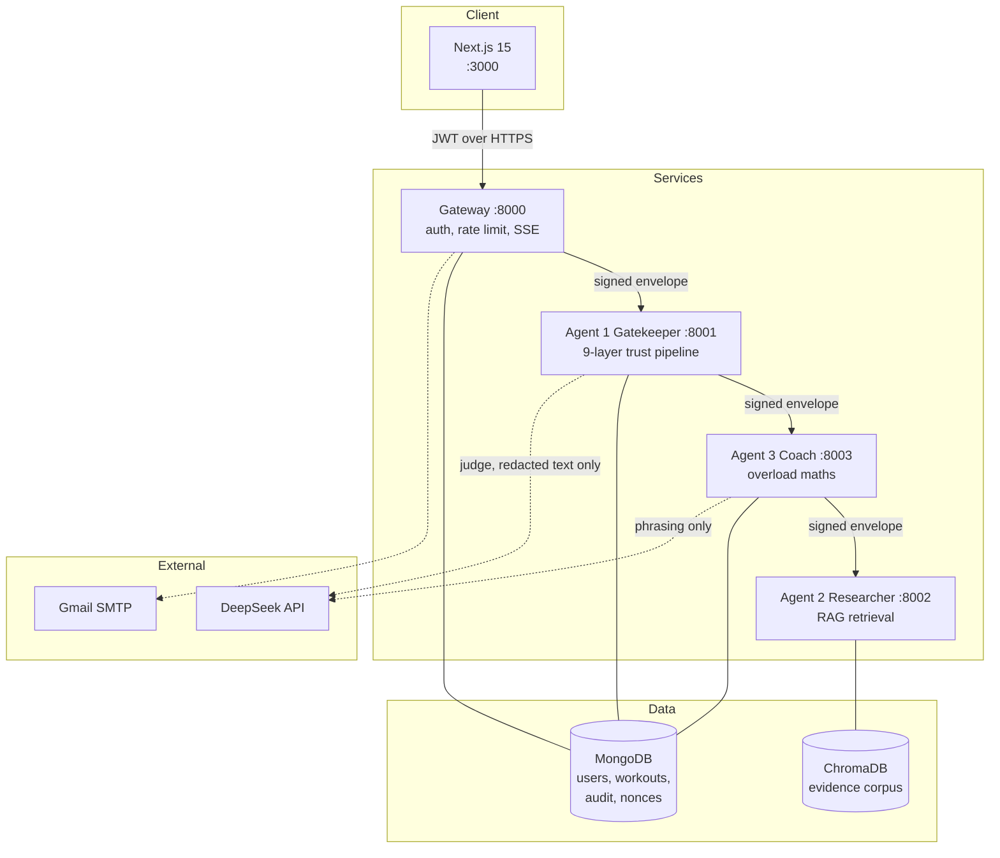
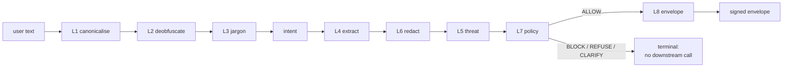
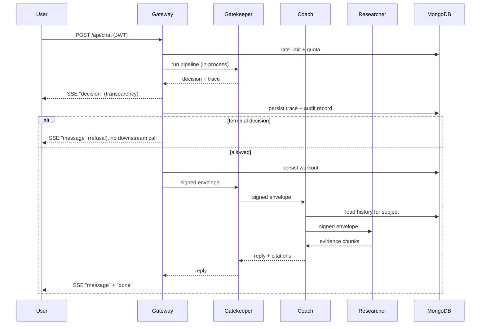

# Architecture

## Components

Solid arrows carry signed envelopes. Dotted arrows are external calls, and both
carry only redacted text.

---

## The Gatekeeper pipeline

Order is a security property, not an implementation detail.

| Layer | Purpose | Why it sits here |
| --- | --- | --- |
| L0 | Rate limit, quota | In the gateway, before any pipeline work |
| L1 | Unicode canonicalisation | Must be first, or later layers match the attacker's encoding |
| L2 | Decode base64, hex, ROT13, leet | Before L5, or an encoded payload scores as noise |
| L3 | Jargon expansion | Before L4, so extraction sees standardised terms |
| Intent | Classification | Before L7, which conditions on it |
| L4 | Structured extraction | Before L7, which conditions on confidence |
| **L6** | **PII redaction** | **Before L5's judge: the only external call in the pipeline** |
| L5 | Hybrid threat scoring | Local signals see everything; the judge sees redacted text only |
| L7 | Policy decision | Consumes everything above |
| L8 | Envelope and audit | Only on a non-terminal decision |

**The L5/L6 ordering looks inverted and is not.** L5's rule and semantic
signals are local computation, so they can safely see unredacted variants. Only
the judge leaves the process, and it receives redacted text. This is asserted
by `test_redaction_precedes_any_external_call`, which intercepts the judge and
inspects exactly what it was given.

---

## Request sequence

---

## Data model

| Collection | Purpose | Key indexes |
| --- | --- | --- |
| `users` | Accounts | unique `email` |
| `refresh_tokens` | Rotating sessions | unique `token_hash`, TTL on `expires_at` |
| `email_tokens` | Verification and reset | unique `token_hash`, TTL on `expires_at` |
| `workouts` | Logged sessions | `(user_id, session_date)`, `(user_id, exercise, session_date)` |
| `audit_events` | Hash-chained security log | unique `seq`, by `correlation_id` |
| `envelope_nonces` | Replay protection | unique `message_id`, TTL on `expires_at` |
| `telemetry` | Token spend | `(user_id, created_at)` |
| `rate_limits` | Sliding windows | `key`, TTL on `expires_at` |
| `decision_traces` | Explainability | unique `message_id`, TTL 30 days |

TTL indexes let MongoDB expire nonces, tokens and traces itself, so there is no
cleanup job and the replay window cannot grow unbounded.

---

## Key design decisions

Each has an ADR in `docs/adr/`.

| ADR | Decision |
| --- | --- |
| 0001 | Signed envelopes for all inter-agent communication |
| 0002 | Discriminate the payload union on `kind`, not `intent` |
| 0003 | Aho-Corasick for jargon expansion |
| 0004 | Constrain fuzzy correction after it corrupted ordinary text |
| 0005 | Hybrid three-signal threat detection, with measured weaknesses |
| 0006 | Hash-chained audit log |
| 0007 | Add `subject` to the envelope header (breaking change) |
