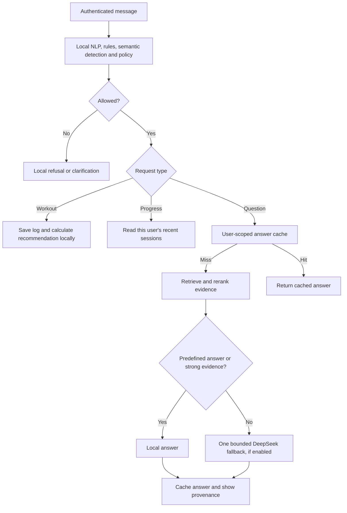

# FitCoach: project review and implementation guide

This review compares the repository with the five supplied documents and the current request. The documents are requirements and historical prompts, not new commands to execute. The current request authorises improving all three agents and replacing the intentionally plain UI.

## What the documents mean

| Document | Purpose | What to retain or change |
|---|---|---|
| `workload_each_agent.pdf` | Proposed responsibilities and algorithms for three team members | Keep Gatekeeper / Researcher / Coach ownership and deterministic arithmetic. Treat example latency, token and dollar amounts as illustrations, not measurements. |
| `CLAUDE.md` | Original coding conventions | Keep secret handling, signed envelopes, transparent decisions and testable functions. Its restriction against editing teammates' internals is superseded by this request. Shared envelope schemas remain unchanged. |
| `Claude_Code_Prompts.md` | Staged build instructions P0–P5 | P3 explicitly requested “Clean, readable, no design flourishes,” explaining the old UI. These prompts scaffold capabilities but cannot prove they work. Their historic tests and security conclusions must be reproduced. |
| Group brief | Assessed product requirements | At least two interacting agents, LLM + NLP + IR + security + defined protocol, Responsible AI, commercialisation with pricing, report, repository, video and viva. It does not require spending LLM tokens on every request. |
| Individual brief | Independent vulnerability assessment | At least 15 independent cases in the assigned specialisation, actual evidence, impact/likelihood/severity justification and reflection. Fixing the app does not replace the student's independent assessment. Preserve old evidence as evidence of the old build. |

The downloaded prompt says Python 3.11; the repository actually requires Python 3.13. Use the repository environment. Model names are configurable: do not assume a copied prompt proves current provider compatibility.

## Confirmed problems and implemented changes

| Problem | Cause | Implemented behaviour |
|---|---|---|
| “My bench has stalled at 80kg” logged as a workout | Numeric structure took priority over plateau wording | Plateau phrases route to a programming question before numeric log detection. |
| Incomplete load/reps accepted | Missing-field policy depended on a confidence boundary | Missing essential fields trigger clarification regardless of that boundary. An omitted set count remains optional and is not fabricated by extraction. |
| Rephrasing burns tokens | Coach always asked the strong model to explain deterministic numbers | Calculated workout rationales are returned directly. |
| Every question calls a model | Retrieved passages were only prompt context | Exact predefined answers and sufficiently strong evidence matches answer locally. |
| Repeated question repeats generation | No answer cache | User-scoped Mongo cache, 24-hour expiry, content-version invalidation. Current security checks still run before cache access. |
| Progress question ignores stored workouts | All questions used generic RAG | Progress intent reads the user's recent workout records directly. This is a recent-session summary, not arbitrary natural-language database analytics. |
| Same sources recur | Narrow corpus, fixed broad query and no diversification | 26 chunks, broader candidate retrieval, lexical/topic reranking, one result per source and near-duplicate removal. The same relevant source may legitimately recur across different questions. |
| Editing corpus does nothing | Index seeded only when empty | Content fingerprint and upsert refresh the persistent collection on restart. Imported documents are preserved. |
| Judge looks broken at `0.000` | UI did not distinguish skipped from completed | Shows disabled, outside-band, unavailable or completed state, plus raw semantic similarity. A zero risk score on benign text is correct. |
| Workout contributes twice to coaching | Gateway saves before coach loads history and coach appends again | Exclude the current correlation ID from historical records before appending. |
| Chat freezes after network failure | No `finally` resetting busy state | Request guard, visible connection error, restored text and bounded auth refresh. |
| Generic UI | Original prompt explicitly asked for one | Responsive coaching workspace, green/cream visual system, starter cards, evidence links, route/token labels and mobile layout. |

## Request flow and token controls



Defaults in `shared/config.py` and `.env.example`:

```dotenv
LLM_FALLBACK_ENABLED=true
LLM_JUDGE_ENABLED=false
LLM_MAX_OUTPUT_TOKENS=350
```

The judge setting is an explicit cost/security tradeoff. Local rules and embeddings still run. Enabling it permits an extra paid security call in the uncertain band **before** database/RAG access. Set both flags false for a fully local experience. Existing `.env` values override defaults; no secret values were changed.

Fallback uses the configured fast model, at most two 400-character evidence passages, at most 1,000 characters of redacted user input, 350 output tokens by default, no automatic SDK retries, and thinking disabled. The 350 cap is an **output** cap; input tokens are still billed. Missing evidence is disclosed as general guidance and is not presented as a verified citation. Provider behaviour: [DeepSeek thinking mode](https://api-docs.deepseek.com/guides/thinking_mode/).

Do not report a percentage bill reduction without workload measurements. Deterministic/predefined/strong-evidence paths prove zero coaching calls in tests; the saving on real traffic depends on the mix of questions and cache hits. The telemetry includes judge tokens when enabled. Provider errors may have unreported usage, so application counters are not invoice reconciliation.

## Per-agent plans and follow-up prompts

- [Agent 1 — Gatekeeper and gateway](agent-plans/agent-1-gatekeeper.md)
- [Agent 2 — Researcher](agent-plans/agent-2-researcher.md)
- [Agent 3 — Coach](agent-plans/agent-3-coach.md)
- [Frontend and integration](agent-plans/frontend-integration.md)

Each file explains responsibilities, current changes, tests, remaining limitations and a scoped prompt for a later iteration. These are project-agent plans, not instructions to run autonomous coding agents.

## Validation and honest limits

Backend: 274 tests passed with local cached embeddings and a separate `.tmp/test-chroma` database. Ruff checks passed. Frontend production build passed. Browser checks at 1440px and 375px verified starter submission, streamed reply rendering, detector state and no horizontal overflow; these browser checks used mocked API responses. Screenshots in [screenshots](screenshots/) are UI fixtures, not live account or security evidence.

The 300-case **local-detector** benchmark was rerun: precision 1.000, recall 0.867, F1 0.929, false positive rate 0.000. Twelve of 90 adversarial cases were missed. The threat metric's confusion matrix counts 240 applicable benign/adversarial examples, not every medical/out-of-domain example. This is not a claim that all attacks are blocked. The historical judge-enabled benchmark was not rerun with paid requests.

Remaining boundaries: the corpus is curated summaries, not a full literature ingestion system; original legacy source attributions need bibliographic review. Retrieval thresholds are heuristics, not confidence probabilities. The coach currently recommends for the first exercise in a multi-exercise log. The proposal's whole-week 10% volume cap is not implemented and must not be described as a medical safety guarantee. The cache does not merge simultaneous misses across processes. Daily quota checks are not an atomic reservation of future tokens. No live DeepSeek billing, SMTP delivery or four-service Mongo end-to-end run was performed during these checks.

## Running the updated project

Restart gateway and all agents to load Python changes and refresh the corpus; restart/rebuild the web app. Existing workout data need not be deleted. First researcher startup re-embeds changed curated content; subsequent starts reuse the fingerprint. See the repository README for local or Docker startup commands.

For a zero-token demo, use the predefined starter cards, a complete workout log and “Show me my progress.” Confirm that the reply route is local and tokens are zero. Then test an uncovered fitness question separately to demonstrate the bounded LLM fallback. Keep an actual paid-call test separate from unit tests.

Submission still requires your own report analysis, commercialisation/pricing assumptions, the 3–5 minute video and independent vulnerability evidence. Existing generated scaffolding is not proof that these deliverables are complete.

