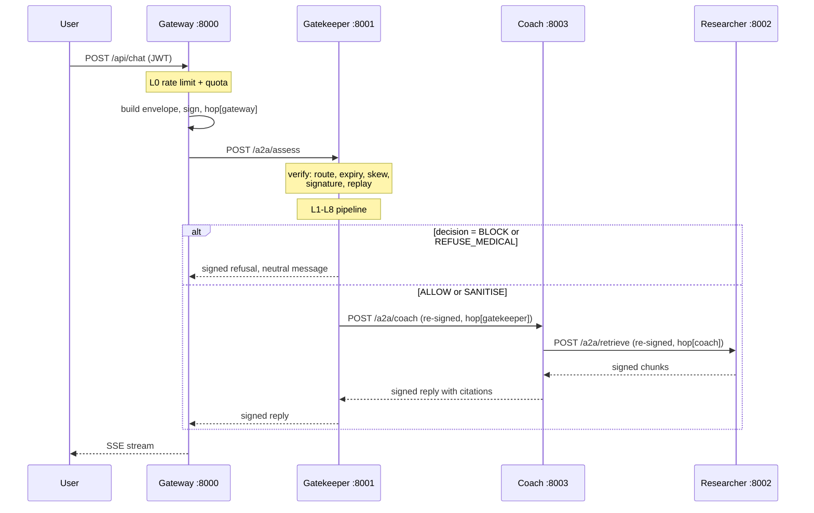

# FitCoach Agent-to-Agent (A2A) Protocol v1.0

Every inter-service message in FitCoach is a signed **envelope**. There is no
bare JSON between services. This document specifies the wire format, the
threat model it addresses, and the error taxonomy.

Implementation: [`shared/contracts/`](../shared/contracts/).

---

## 1. Why an envelope at all

The system splits one user turn across four processes. Three properties must
survive that split:

1. A downstream agent must know **who** sent a message and that it was not
   modified on the way.
2. The Gatekeeper's safety verdict must travel **with** the message. If the
   coach had to re-derive risk, the safety logic would be duplicated in a
   service a teammate owns, and any disagreement between the two would be a
   vulnerability.
3. One user turn must be traceable across all four services, for debugging and
   for the explainability requirement.

A plain HTTP call with a bearer token gives none of these. It authenticates the
connection, not the message, so anything that terminates TLS can alter the body
and any field describing trust.

---

## 2. Envelope schema

```jsonc
{
  "envelope_version": "1.0",
  "message_id": "9f2c...",        // unique; single-use, see replay protection
  "correlation_id": "a1b2...",    // one value for the whole user turn
  "trace": [                       // routing history, NOT signed
    { "agent": "gateway", "received_at": "...", "latency_ms": 4.2 }
  ],
  "sender": "gateway",
  "recipient": "agent1_gatekeeper",
  "issued_at":  "2026-09-09T11:20:34.393045Z",
  "expires_at": "2026-09-09T11:22:34.393045Z",
  "intent": "PROGRAM_QUERY",
  "trust": {
    "risk_score": 0.07,
    "decision": "ALLOW",
    "reason_codes": ["CLEAN"],
    "detector_versions": { "rules": "1.0", "embeddings": "MiniLM-L6-v2" },
    "extraction_confidence": 0.91,
    "policy_rule_id": "allow-default",
    "signal_contributions": { "rules": 0.02, "semantic": 0.07, "judge": 0.0 }
  },
  "payload": { "kind": "QUERY", "intent": "PROGRAM_QUERY", "...": "..." },
  "signature": "hex HMAC-SHA256"
}
```

### Header vs payload

The header is readable without parsing the payload, so a recipient can make a
routing and authorisation decision before touching user-influenced content.

### Two discriminators

`intent` says what the *user* wants. `kind` says what *shape* the message is.
They are separate because one intent legitimately appears on several message
shapes: a `PROGRAM_QUERY` is the intent of both the question travelling toward
the coach and the reply travelling back. The payload union is discriminated on
`kind`; `Envelope` then validates that the payload's intent equals the header's,
so a payload cannot misrepresent itself in either dimension.

---

## 3. Canonicalisation

An HMAC covers bytes, but an envelope is a JSON object, and one object has many
valid encodings. Key order, whitespace, unicode escaping and float formatting
all differ between serialisers. Without a fixed encoding every legitimate
message would fail verification.

Hashing the received byte string instead is worse: the receiver would have to
verify before parsing and validating, so it would trust unvalidated bytes, and
any proxy that reformats JSON would silently break authentication.

Both sides therefore derive the signed bytes from the *parsed and validated*
object, using one deterministic encoding (`shared/contracts/signing.py`):

| Rule | Reason |
| --- | --- |
| `sort_keys=True` | key order cannot vary between runtimes |
| `separators=(",", ":")` | no insignificant whitespace |
| `ensure_ascii=False`, UTF-8 | exactly one spelling for non-ASCII |
| Timestamps as `%Y-%m-%dT%H:%M:%S.%fZ` UTC | `isoformat` emits `+00:00`; pin one spelling |
| Floats rounded to 6 dp, `-0.0` collapsed | float repr differs between platforms |
| `allow_nan=False` | NaN and Infinity are not valid JSON |
| `extra="forbid"` on the model | the parsed object and the signed bytes describe the same message |

Canonicalisation is also a security control. Without a fixed encoding an
attacker can search for two documents sharing a canonical form, or exploit a
parser that tolerates duplicate keys, and mount signature confusion.

### Unsigned fields

`signature` is excluded because a value cannot cover itself. `trace` is
excluded because every hop appends to it by design.

**Consequence, stated explicitly:** the trace is *auditing evidence, not an
authenticated field*. No component may make a trust decision from it.

---

## 4. Verification

`verify()` enforces, in order:

| # | Check | Property defended |
| --- | --- | --- |
| 1 | `(sender, recipient)` is in `ALLOWED_ROUTES` | Least privilege. Holding the shared key must not permit addressing any peer. |
| 2 | Envelope is addressed to this service | Prevents redirecting a valid envelope to a different agent. |
| 3 | `expires_at` is in the future | Bounds how long a captured envelope stays useful. |
| 4 | `issued_at` is not beyond skew tolerance | A forged future timestamp would extend the replay window arbitrarily. |
| 5 | HMAC-SHA256 matches, via `compare_digest` | Authenticity and integrity. |
| 6 | `message_id` unused (`replay.py`) | Single-use; a signature proves authorship, not freshness. |

Ordering is for cost, not security: every failure maps to the same 401 family,
so status codes do not tell an attacker which check failed.

### Why `compare_digest` and not `==`

`==` returns at the first differing byte, so comparison time leaks how many
leading bytes were correct. An attacker timing many requests recovers a valid
signature byte by byte, roughly 256 x 64 attempts instead of 2^256.
`compare_digest` runs in time independent of the first difference.

### Why the replay check is last

It is the only step needing a database round trip. Running it first would let
an unauthenticated caller fill the nonce collection: cheap denial of service
against storage.

---

## 5. Replay protection

A signature proves a message was authored by a key holder. It does not prove
the message is **new**. Two mechanisms close this together:

- `expires_at` bounds the window in which a captured envelope is useful.
- `message_id` makes each envelope single-use within that window.

Neither suffices alone. Without expiry the nonce set grows forever; without the
nonce a message is freely replayable until it expires.

The check is atomic by construction. A read-then-write has a race where two
concurrent copies both observe "unseen". Instead the guard inserts first and
treats a duplicate-key error as detection, pushing atomicity into a MongoDB
unique index. A TTL index on `expires_at` expires records automatically, so the
store stays bounded with no cleanup job.

If the nonce store is unavailable the guard **fails closed**: an unverifiable
message is rejected rather than silently disabling replay protection.

---

## 6. Threat model

| Threat | Control |
| --- | --- |
| Message forgery | HMAC-SHA256 over canonical bytes |
| Modification in transit | Signature covers header, trust block and payload |
| Replay | `message_id` nonce plus TTL |
| Delayed replay after capture | `expires_at` |
| Forged timestamp | Clock-skew tolerance |
| Lateral movement between services | `ALLOWED_ROUTES` |
| Downgrading a risk verdict | `trust` is inside the signed region |
| Field smuggling | `extra="forbid"` |
| Timing attack on the signature | `hmac.compare_digest` |
| Prompt injection in user text | Spotlight delimiters; text carried only in `raw_text_redacted` |
| Error-message oracle | One rejection shape, detail only in server logs |

### Out of scope

The shared HMAC key is symmetric, so any service holding it can mint an
envelope for any route it is permitted. Full compromise of one service is
therefore not contained by this protocol; per-agent asymmetric keys would be
required. Documented as accepted risk for a coursework deployment.

---

## 7. Error taxonomy

All errors return `application/problem+json` (RFC 7807).

| Type suffix | Status | Meaning |
| --- | --- | --- |
| `#envelope-rejected` | 401 | Generic rejection; specifics only in logs |
| `#signature-invalid` | 401 | HMAC mismatch or unsigned |
| `#envelope-expired` | 401 | Past `expires_at`, or skew exceeded |
| `#replay-detected` | 401 | `message_id` already consumed |
| `#unknown-peer` | 401 | Route not permitted, or wrong recipient |
| `#payload-mismatch` | 422 | Payload does not match declared intent |
| `#rate-limited` | 429 | Sliding-window limit, with `Retry-After` |
| `#quota-exceeded` | 429 | Daily token quota |
| `#request-blocked` | 403 | Policy engine refusal, neutral message |
| `#upstream-unavailable` | 503 | Peer unreachable after retries |

---

## 8. Sequence



---

## 9. Verified behaviour

Exercised against the running stack on 2026-09-09; see
`tests/contracts/` (31 passing) and the live boundary probe.

| Case | Result |
| --- | --- |
| Valid envelope | 200 |
| Same envelope replayed | 401 |
| Unsigned envelope | 401 |
| Signed with the wrong key | 401 |
| `risk_score` lowered after signing | 401 |
| Unknown field smuggled in | 401 |
| Malformed body | 401 |
| Correlation ID across four services | present in all four logs |
| Hop accumulation | gatekeeper 1, coach 2, researcher 3 |

---

## 10. Status

`shared/contracts/` is **frozen** as of this document. Any change is a breaking
change for three developers and must be raised before it is made.
